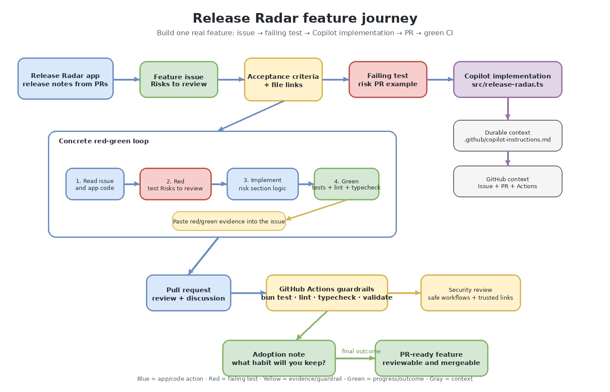

# Visual overview

The workflow map shows the actual point of the exercise: ship a concrete Release Radar feature, not a workflow diagram about workflows.

## How to read the diagram

1. **Start with the app.** Release Radar already builds release notes from merged GitHub pull requests.
2. **Create the feature issue.** The target is specific: add a `## Risks to review` section for PRs labeled `security`, `dependency`, or `migration`.
3. **Write the failing test.** The red test proves the app does not yet meet the acceptance criteria.
4. **Use Copilot to implement.** Copilot helps change `src/release-radar.ts`, but the test and issue define done.
5. **Open a PR.** The pull request links the issue, implementation, and red/green evidence.
6. **Trust the guardrails.** Tests, lint, typecheck, validation, and security review make the feature reviewable.

The editable source is [`diagrams/copilot-workflow.drawio`](diagrams/copilot-workflow.drawio).
